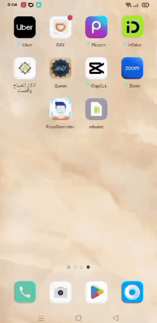
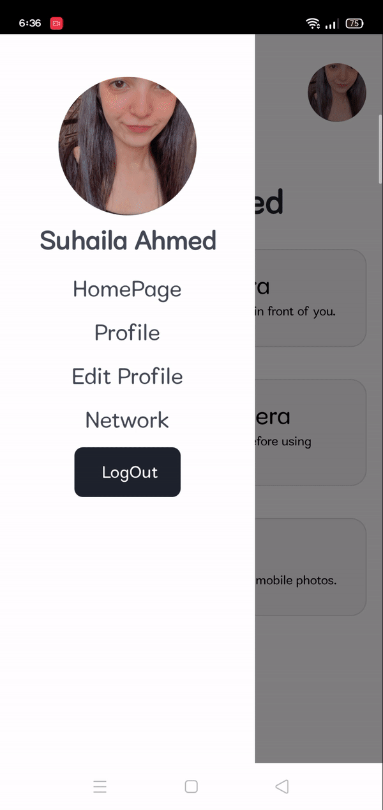

# FaceReminder Application

FaceReminder is a specialized mobile application designed to help individuals affected by prosopagnosia, which impairs their ability to 
remember faces. The app is a helpful tool, enabling users to identify the people around them differently. It offers three main methods of 
capturing images: using the device's camera, an external camera, or uploading photos from the device's gallery.
Using a face recognition model, the application can accurately detect faces in the provided images and provide essential information about the 
recognized individuals.

## Recognition by uploading an image

</img>

## Recognition by ESP32 Camera image

</img>

## Recognition by Mobile Camera image

</img>

## Side Bar options

</img>

## Login, Logout, Sign Up, Forget password

</img>
